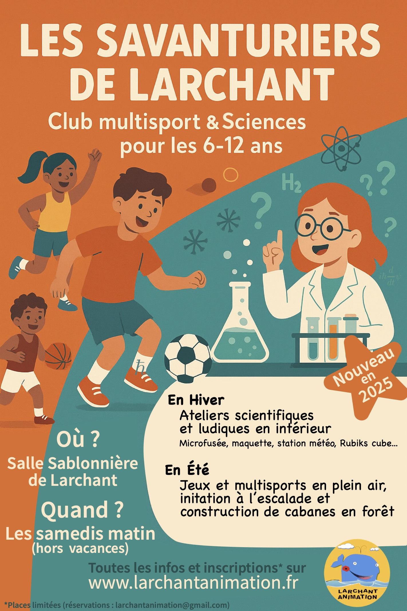

# Club multisport et Sciences pour les enfants de 6 à 12 ans

## Présentation

En Septrembre 2025 le club multisport devient les Savanturiers. Nous vous accueillons cette année pour une rentrée sportive et ludique pour les enfants de 6 à 13 ans.
Les savanturiers de Larchant propose des activités sportives et scientifiques variées pour les enfants, avec un accent sur la découverte, l'entraide et l'apprentissage dans une ambiance conviviale. 

Les encadrants sont **des bénévoles de l'association** qui sauront accompagner vos enfants dans leur découverte des sports et leur apprentissage.

* Elsa, professeure d'EPS
* Sylvain, Moniteur d'escalade
* Hugo, certificat de qualification d'escalade et expert du Rubik's Cube
* Quentin, diplomé du BAFA (animateur) et du BAFD (directeur de centre de loisirs) et professeur de Physique à la Sorbonne.
* Antonine, professeure de yoga et docteure en Physique quantique.
* Garance, architecte et passionnée de maquettes
* Alice, diplomée de cirque

En hiver, nous serons en salle Sablonnière à Larchant pour des ateliers scientifiques et ludiques: construction de microfusées, réalisation de maquettes, construction d'une station météo, découverte du Rubik's cube. En été, nous serons en extérieur pour des jeux et du sport: jeux collectifs, escalade, course d'orientation, construction de cabanes, etc. Nous aurons aussi des séances de découverte du cirque et du yoga.

<!-- 
 
          <a href="https://larchant-animation.s2.yapla.com/fr/ateliers-enfants-2024-2025-14144" class="items-center px-6 py-3 border border-transparent text-base font-medium rounded-md shadow-sm text-white bg-indigo-500 hover:bg-indigo-800 focus:outline-none focus:ring-2 focus:ring-offset-2 focus:ring-indigo-500 ">
            S'inscrire en ligne
          </a>
          

 -->

## Tarifs

30 séances de 50mns à 1h20 : 100 €

## Horaires

Samedi matin. Plus de précisions en septembre.

<!-- ## Calendrier des activités
!\[Calendrier](CML25.png "Calendrier") -->

## Contact

Antonine au 0647681326

