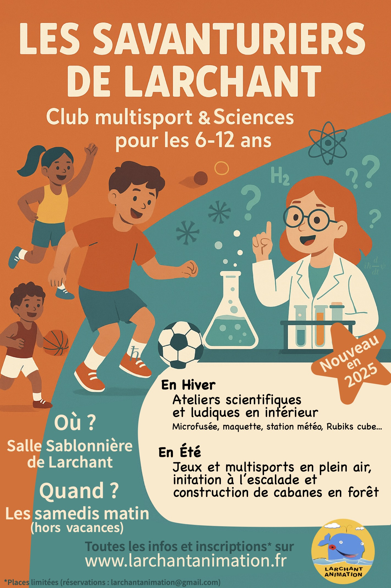

# Club multisport et Sciences pour les enfants de 6 à 12 ans

## Présentation

Les Savanturiers de Larchant reviennent pour la saison 2026-2027 ! Nous accueillons les enfants de 6 à 13 ans pour une année placée sous le signe de la nature, des animaux, de la forêt, du marais et des sciences.
Les Savanturiers de Larchant proposent des activités sportives et scientifiques variées pour les enfants, avec un accent sur la découverte, l'entraide et l'apprentissage dans une ambiance conviviale.

La rentrée est prévue le **samedi 5 septembre 2026**. Le planning détaillé des activités sera publié prochainement, une fois les interventions confirmées.

Les encadrants sont **des bénévoles de l'association** qui sauront accompagner vos enfants dans leur découverte des sports et leur apprentissage.

* Elsa, professeure d'EPS
* Sylvain, Moniteur d'escalade
* Hugo, certificat de qualification d'escalade et expert du Rubik's Cube
* Quentin, diplomé du BAFA (animateur) et du BAFD (directeur de centre de loisirs) et professeur de Physique à la Sorbonne.
* Antonine, professeure de yoga et docteure en Physique quantique.
* Garance, architecte et passionnée de maquettes
* Alice, diplomée de cirque

En hiver, nous serons en salle Sablonnière à Larchant pour des ateliers scientifiques et ludiques. En été, nous serons en extérieur pour des jeux, du sport et des sorties nature. Au programme cette année (sous réserve de confirmation) : escalade, échecs, chimie et microscopie, cirque, sorties en forêt et au marais, et bien d'autres surprises.

<!-- 
 
          <a href="https://larchant-animation.s2.yapla.com/fr/ateliers-enfants-2024-2025-14144" class="items-center px-6 py-3 border border-transparent text-base font-medium rounded-md shadow-sm text-white bg-indigo-500 hover:bg-indigo-800 focus:outline-none focus:ring-2 focus:ring-offset-2 focus:ring-indigo-500 ">
            S'inscrire en ligne
          </a>
          

 -->

## Tarifs

30 séances de 50mns à 1h20 : 100 €

## Horaires

Samedi matin. Plus de précisions en septembre.

<!-- ## Calendrier des activités
!\[Calendrier](CML25.png "Calendrier") -->

## Contact

Antonine au 0647681326

