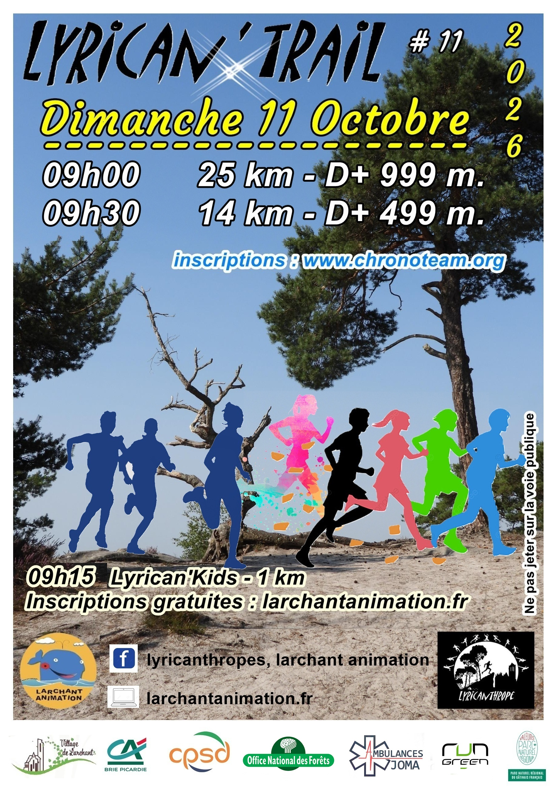

# Lyrican'Trail 2026

## Dimanche 11 octobre 2026

La 11e édition du Lyrican'Trail !

## Horaires

* **9h00** : 25 km, D+ 999 m
* **9h15** : Lyrican'Kids, 1 km (7-11 ans)
* **9h30** : 14 km, D+ 499 m

## Lieu : Larchant

## Inscriptions

Les inscriptions se feront en ligne sur [chronoteam.org](https://www.chronoteam.org). **Le lien d'inscription sera publié ici très prochainement.**

Le Lyrican'Kids est gratuit, inscriptions sur larchantanimation.fr.

###### Le Lyrican'Trail propose plusieurs distances pour satisfaire tous les coureurs, des débutants aux plus expérimentés :

###### Trail de 14 km : ce parcours offre un aperçu des merveilles naturelles de Larchant et de ses dénivelés. Idéal pour les néophytes avant de se lancer dans la version longue.

###### Trail 25 km : parcours exigeant au fort dénivelé avec des parties techniques idéal pour les traileurs (euses) averties.

###### Le Lyrican'Kids : un parcours de 1 km, parfait pour les enfants souhaitant découvrir le sport tout en s'amusant.

## Éditions précédentes

### Lyrican'Trail 2024

* Dimanche 13 octobre 2024
* Horaires : 25 km 9h / 14 km 9h20 / Lyrican'kids 9h30
* Tarifs : 19 € et 13 €, gratuit pour le Lyrican'kids
* Inscriptions : [chronoteam.org](https://www.chronoteam.org/lyrican-trail-2024/)
