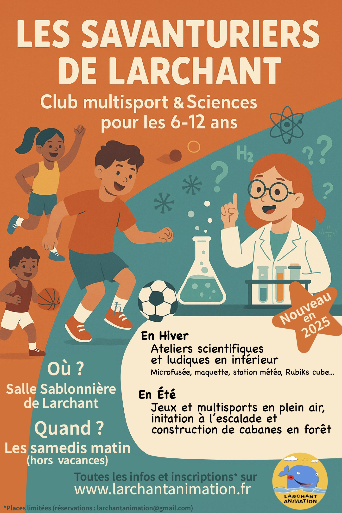

# Club multisport et Sciences pour les enfants de 6 à 12 ans

## Présentation

En septembre 2025, le club multisport devient **Les Savanturiers**. Nous vous accueillons cette année pour une rentrée sportive et ludique destinée aux enfants de 6 à 12 ans.\
Les Savanturiers de Larchant proposent des activités sportives et scientifiques variées, avec un accent sur la découverte, l’entraide et l’apprentissage dans une ambiance conviviale.

Les encadrants sont **des bénévoles de l'association** qui accompagneront vos enfants dans leur découverte des sports et leur apprentissage scientifique :

* **Elsa**, professeure d’EPS  
* **Sylvain**, moniteur d’escalade  
* **Hugo**, certifié en escalade et expert du Rubik’s Cube  
* **Quentin**, diplômé du BAFA (animateur) et du BAFD (directeur de centre de loisirs), professeur de Physique à la Sorbonne  
* **Antonine**, professeure de yoga et docteure en Physique quantique  
* **Garance**, architecte passionnée de maquettes  
* **Alice**, diplômée de cirque  

En hiver, nous nous réunissons en salle Sablonnière à Larchant pour des **ateliers scientifiques et ludiques** :  

* Construction de microfusées  
* Réalisation de maquettes  
* Montage d’une station météo  
* Initiation au Rubik’s Cube  

En été, nous passons en extérieur pour des **jeux et du sport** :  

* Jeux collectifs  
* Escalade  
* Course d’orientation  
* Construction de cabanes  
* Séances de cirque et de yoga  

<!--

  <a href="https://larchant-animation.s2.yapla.com/fr/ateliers-enfants-2024-2025-14144" class="items-center px-6 py-3 border border-transparent text-base font-medium rounded-md shadow-sm text-white bg-indigo-500 hover:bg-indigo-800 focus:outline-none focus:ring-2 focus:ring-offset-2 focus:ring-indigo-500">
    S'inscrire en ligne
  </a>

-->

## Tarifs

30 séances (50 min à 1 h 20) : **100 €**

## Horaires

Samedi matin. Plus de précisions en septembre.

## Contact

Antonine : 06 47 68 13 26

